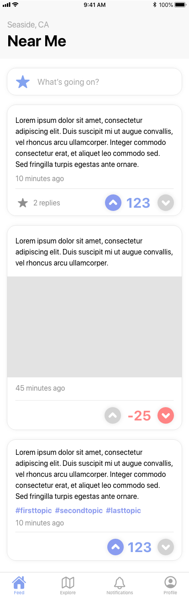
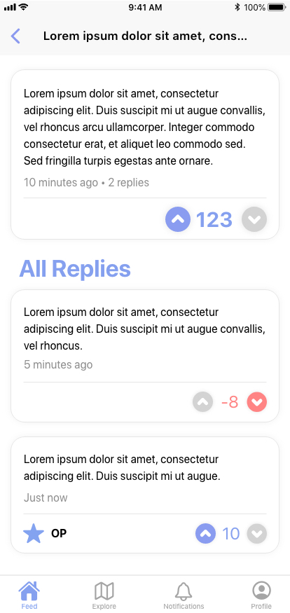
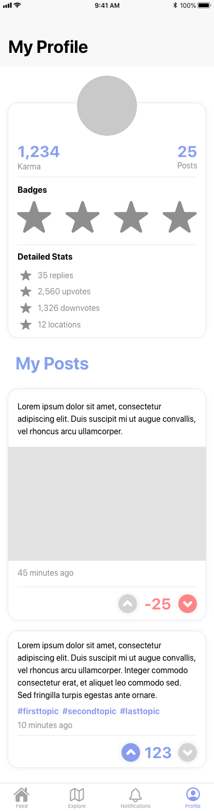

# Product requirements document (PRD)

## Whoot

### What is Your App Vision Statement?
A fusion of Yik Yak and Reddit that anonymously connects users to their communities.

### Features

#### Basic Functionality
* Sign-up and login
* Splash screen
* Navigation
* Anonymous posting
* Post interactions (like, dislike, favorite, etc.)
* Local community posts

#### Stretch Goals
* Users can choose location radius
* Optional username
* Upload photos
* User profile pictures
* Comments
* Topic rooms (like subreddits)

### What is Your Monetization Model?
> There are several monetization strategies worth exploring. The strategy you choose will depend on the type of app you’re developing and your target user. Conventional monetization models include advertising, pay per download, in-app purchases, freemium, and subscriptions.
* Advertising

### Product & Technical Specifications
* What operating system versions should support it? 
> * iOS
> * What are your current services, servers, databases? 
> * Firebase
> * Do you have current API/services documentation? 
> * Twitter, Facebook, Instragram
> * Do you have current Apple, Google, or other developer accounts/credentials? 
> * No
> * Are there other credentials that are needed or already exist (analytics systems, or platforms)?
> * No

### Dependencies
> Dependencies are any aspect that the product or product team relies on to meet objectives.
* Firebase

### Milestones
* Login with phone number
* Create and interact with posts
* Limit the user to current location
* Create anonymous profiles
* Start implementing stretch goals

### Wireframes 

#### Home Feed

#### Post Detail

#### Profile Page

